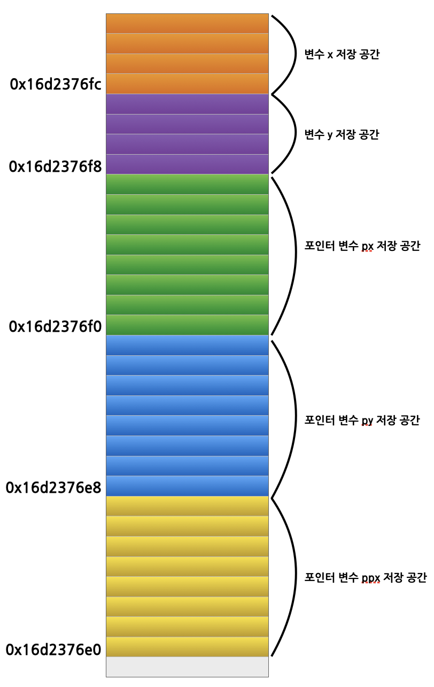

# 이중 포인터 (Double Pointer)

포인터 변수는 참조 변수와 달리 주소를 저장하기 위한 저장 장소가 메모리에 할당된다. 
그러므로 포인터 변수를 저장하기 위해 할당된 메모리의 주소를 저장하는 포인터 변수의 포인터를 이중 포인터라고 한다. 

이중 포인터의 선언은 다음과 같이 ```*```를 두 개 붙인다.

```c++
int x;           // int 자료형의 일반 변수 x 선언
int* px = &x;    // int 자료형의 포인터 변수 px 선언
int** ppx = &px; // int 자료형의 이중 포인터 변수 ppx 선언
```
이중 포인터의 예는 다음과 같다.

```c++
#include <iostream>

using namespace std;

int main(int argc, char const *argv[])
{
	int x = 10;
	int y = 20;
	int* px = &x;
	int* py = &y;

	int**ppx = &px;

	cout << "변수 x의 저장 주소: " << px << endl;
	cout << "변수 y의 저장 주소: " << py << endl << endl;;

	cout << "포인터 변수 px의 저장 주소(&px): " << &px << endl;
	cout << "포인터 변수 py의 저장 주소(&py): " << &py << endl << endl;;

	cout << "ppx 에 저장된 주소(*ppx): " << *ppx << endl;
	cout << "px에 저장된 주수(px): " << px << endl;
	cout << "ppx에 저장된 주소(ppx): " << ppx << endl;
	cout << "포인터 변수 ppx의 저장 주소(&ppx): " << &ppx << endl;

	return 0;
}
```

프로그램의 실행 결과는 다음과 같다.

```bash
변수 x의 저장 주소: 0x16d2376fc
변수 y의 저장 주소: 0x16d2376f8

포인터 변수 px의 저장 주소(&px): 0x16d2376f0
포인터 변수 py의 저장 주소(&py): 0x16d2376e8

ppx 에 저장된 주소(*ppx): 0x16d2376fc
px에 저장된 주수(px): 0x16d2376fc
ppx에 저장된 주소(ppx): 0x16d2376f0
포인터 변수 ppx의 저장 주소(&ppx): 0x16d2376e0
```


