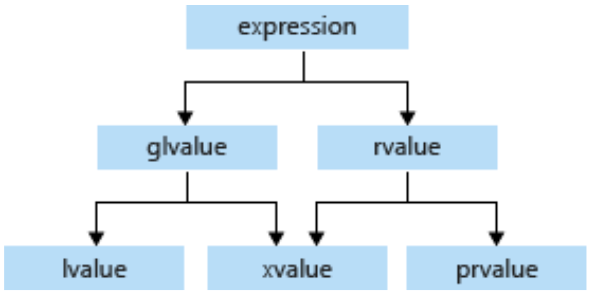

# rvalue와 lvalue

모든 C++ 표현식(피연산자가 있는 연산자, 리터럴, 변수 이름 등)은 자료형과 값 범주(value category)라는 두 가지 독립적인 속성으로 특징지어진다. 
값 범주는 표현식 평가 중에 임시 객체의 생성, 복사, 이동할 때 컴파일러가 따라야 할 규칙의 기반이다.   

C++17 표준은 표현식에 해당하는 값 범주를 다음과 같이 정의한다. C++17표준에서 정의한 값은 범주에는 glvalue, prvalue, xvalue, lvalue, rvalue가 있으며 
각 표현 식은 prvalue, xvalue, lvalue의 세가지 기본 값 범주 중 하나에 속한다.

* **glvalue("generalized" lvalue)**: 객체, 비트 필드 또는 함수의 ID를 결정하는 표현식이다.
* **prvalue("pure" rvalue)**: 객체, 비트 필드를 **초기화**하거나 연산자가 보여지는 맥락에 의해서 지정된 대로 연산자의 피연산자의 값을 **계산**하는 표현식이다.
* **xvalue("eXpiring" value)**: 자원을 재사용할 수 있는 객체, 비트 필드를 나타내는 *glvalue*이다 (일반적으로 수명이 거의 다 되었기 때문에). 
  예: *rvalue 참조(rvalue reference)* 를 포함하는 특정 종류의 표현식은 반환 자료형이 *rvalue 참조(rvalue reference)* 또는 *rvalue 참조 타입(rvalue reference type)* 으로 형변환(cast)되는 함수에 대한 호출과 같은 *xvalue*를 생성한다. 
* **lvalue**: *xvalue*가 아닌 *glvalue*이다 (대입 표현식에서 왼쪽에 나타낼 수 있다는 점에서 lvalue라 불림). 
* **rvalue**: *prvalue* 또는 *xvalue*이다 (대입 표현식에서 오른쪽에 나타날 수 있다는 점에서 rvalue라 불림). 

다음 다이어그램은 표현식을 구성하는 값의 범주 간의 관계를 보인다.



lvalue는 프로그램이 접근할 수 있는 주소를 갖는다. lvalue 표현식의 예로는 const 변수, 배열 요소, lvalue 참조, 비트 필드, 공용체, 클래스 멤버를 를 반환하는 함수 호출을 포함한 변수 이름이 있다. 
prvalue 표현식은 프로그램에서 접근할 수 있는 주소를 갖지 않는다. prvalue 표현식의 예로는 리터럴, 참조가 아닌 자료형을 반환하는 함수 호출 및 표현식을 검사하는 과정 중에는 생성되지만
컴파일러에서만 액세스할 수 있는 임시 객체가 있다. 
xvalue 표현식은 프로그램에서 더 이상 접근할 수 없지만 표현식에 대한 접근을 제공하는 rvalue 참조를 초기하는데 사용할 수 있는 주소를 가진다. 
예로는 rvalue 참조를 반환하는 함수 호출, 배열 또는 객체가 rvalue 참조인 멤버 표현식에 대한 배열 첨자, 멤버와 포인터가 있다. 

C++에서는 Rvalue와 Lvalue이 정의되어 있다.

C++에서는 **표현 식의 계산이 끝난 후 계속 존재하는 객체(값)은 Lvalue, 연산이 끝나면 존재하지 않는 임시 객체(값)는 Rvalue이다.**
*const* 타입을 포함하는 모든 변수는 Lvalue 이다.  


## lvalue reference

C++의 lvalue 참조(lvalue reference)는 존재하는 객체에 대한 또 다른 이름(별명)이다. 객체의 주소를 보유하지만, 구문상 객체처럼 동작한다. 
참조가 한번 정의되면, 참조에 대한 연산은 참조된 객체에 적용된다. 참조 선언자는 ```&``` 이다. 
lvalue 참조 선언은 참조 선언자가 뒤에 나오는 선택적 지정자 목록으로 구성된다. 참조는 초기화되어야 하고 다른 객체를 참조하도록 변경될 수 없다. 

주소가 지정된 포인터 형식으로 변환될 수 있는 객체는 유사한 참조 형식으로도 변환될 수 있다. 
예를 들어 주소가 ```char *```형식으로 변환될 수 있는 객체는 ```char &``` 형식으로도 변환될 수 있다.
**lvale 참조는 기본적으로 참조되는 객체와 동일하다.**

### lvalue 참조 변수 선언 및 초기화 

다음 프로그램 코드 lvalue 참조 변수 선언 및 초기화 에이다. 

```c++
int  x = 5;    // x는 일반 변수 (lvalue)
int& ref = x;  // ref는 lvalue 참조 변수       
```
lvalue 참조 변수는 선언과 동시에 저장공간이 있는 변수로 초기화 되어야 한다. 

### lvalue 참조를 이용한 값 변경 

앞의 프로그램 코드 예는 참조하고 있는 객체의 값을 읽기 위해서 lvalue 참조를 사용할 수 있음을 보였다.
다음 프로그램 코드는 참조된 객체의 값을 변경하기 위해서 lvalue 참조를 사용할 수도 있다. 

```c++
#include <iostream>
using namespace std;

int main(int argc, char const *argv[])
{
	int x {10};
	int& ref {x};

	cout << "(after modify) x: " << x << endl;  // 10 출력

	ref = 40;

	cout << "(after modify) x: " << x << endl;  // 40 출력
	return 0;
}
```
실행 결과는 다음과 같다.
```bash
(after modify) x: 10
(after modify) x: 40
```
### lvalue 참조 변수의 초기화 

다음 코드는 lvalue 참조 변수의 초기화가 제대로 이루어진 경우와 잘못된 경우를 보인다. 
lvalue 참조 변수 ```ref```는 변수 선언과 함께 ```x```로 초기화 하였으나 ``ìnvalidRef```는 변수 선언만 이루어지고 객체로 초기화되지 않아 
에러가 발생한다. 

```c++
#include <iostream>
using namespace std;

int main(int argc, char const *argv[])
{
	int x { 30 };
	int& ref{ x };
	int& invalidRef; //error: declaration of reference variable 'invalidRef' requires an initializer

	return 0;
}
```

lvaue 참조 변수는 수정 가능한 lvalue(modifiable lvalue)로 바운딩되어야 한다. 

```c++
#include <iostream>
using namespace std;

int main(int argc, char const *argv[])
{
	int x = 5;
	int& ref = x;

	const int y = 5;
	int& invalidRef1 = y;  // error: binding reference of type 'int' to value of type 'const int' drops 'const' qualifier
	int& invalidRef2 = 30; // error: non-const lvalue reference to type 'int' cannot bind to a temporary of type 'int'

	return 0;
}
```

## rvalue reference


### 좌측값 

좌측값은 객체를 식별할 수 있는 메모리 위치를 참조한다. 


```c++
int value = 0;  // value(좌측값), 0(우측값)
```
위의 연산 식에서 변수 ```value```는 좌측값이고 상수 0은 우측값이다. 우측값은 식의 우측에 있는 값이다.

```c++
int a = 3;
int b = 4;
int c = a + b;
````
앞의 수식에서 변수 ```a, b, c, d``` 는 좌측값이 되고 ```a + b``` 는 우측값이 된다. 
앞의 연산에서 3, 4와 같은 리터럴과 ``à + b```는 연산의 결과가 임시 객체 내에 존재하다가 식의 계산이 끝난 후 임시 객체는 파기된다. ㅇ

```c++
int a = 10;
int d = a;
```
에서 ```a, d``` 는 좌측값이고 ```10``` 은 우측값이다.

C++에서의 참조는 좌측 값 참조이다. 

## 좌측 값 참조


## reference

* [Value categories](https://en.cppreference.com/w/cpp/language/value_category)
* [기본 개념(C++)](https://docs.microsoft.com/ko-kr/cpp/cpp/basic-concepts-cpp?view=msvc-170)
* [Lvalue 및 Rvalue (C++)](https://docs.microsoft.com/ko-kr/cpp/cpp/lvalues-and-rvalues-visual-cpp?view=msvc-170)
* [Lvalue references](https://www.learncpp.com/cpp-tutorial/lvalue-references/)
